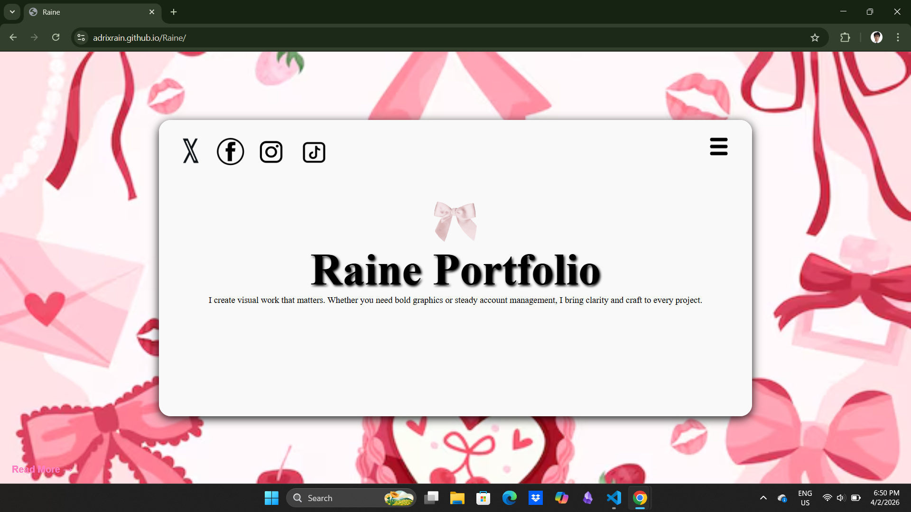
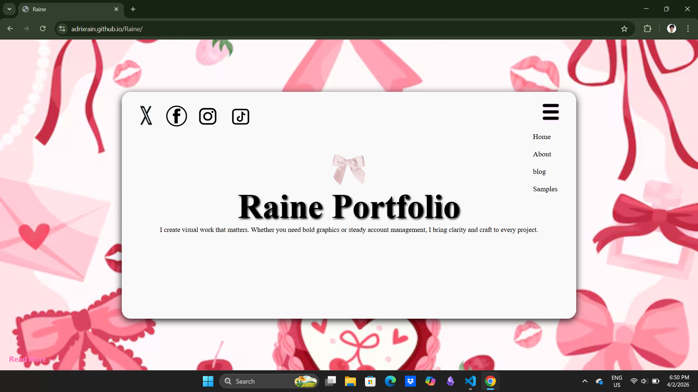
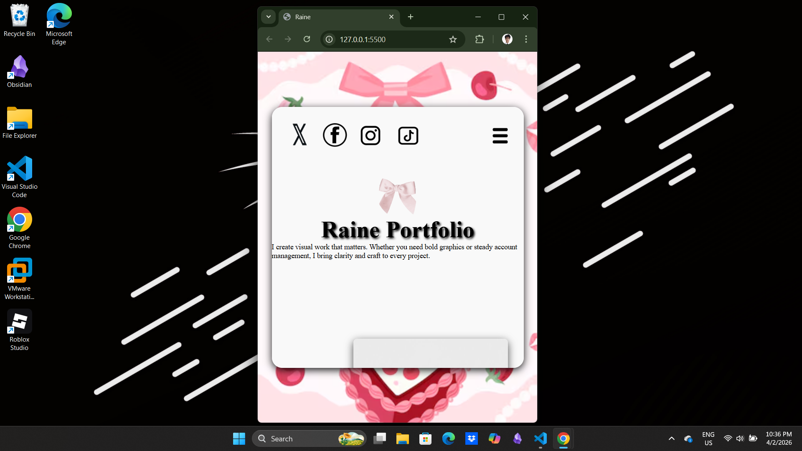
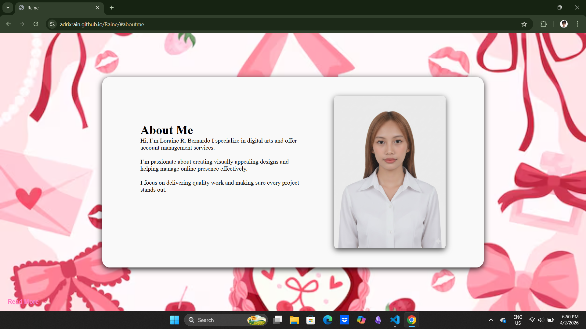
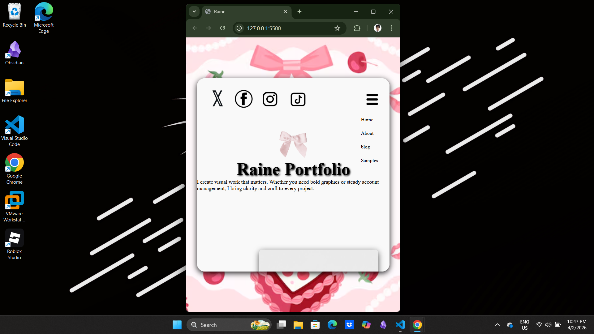
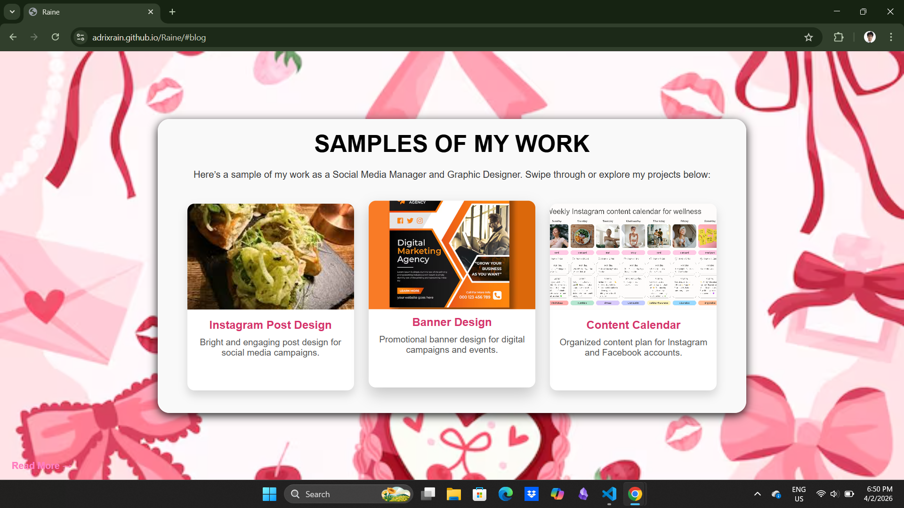
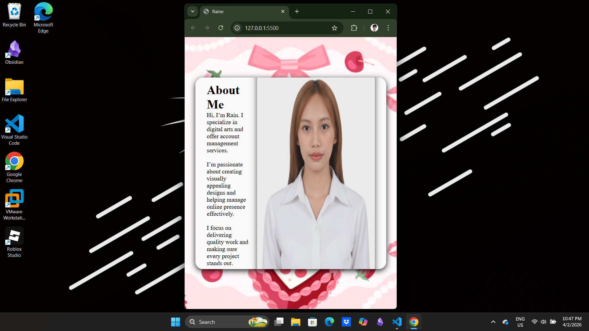
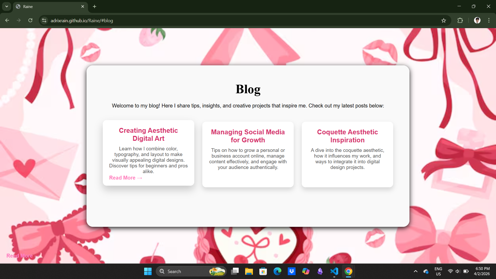

Raine Web Portfolio 

Raine is one of my web projects where I focus on creating responsive websites that look great on any device. 
Through this project, I’m learning how to combine design, coding, and interactivity to make websites that are both functional and user-friendly.

Skills applied in this project:

* HTML, CSS, JavaScript
* Responsive design & layout
* Interactive web elements

13
